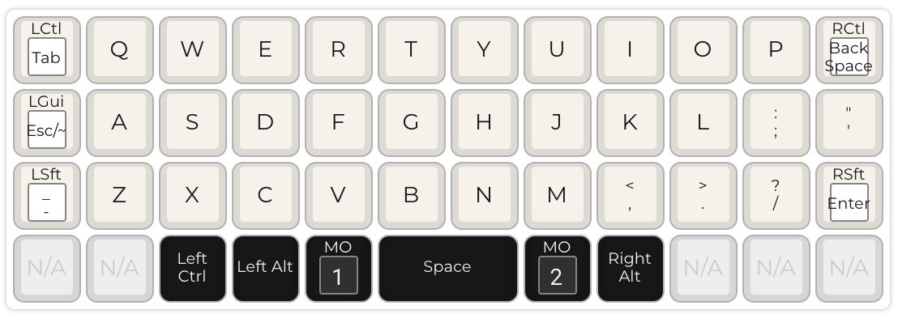
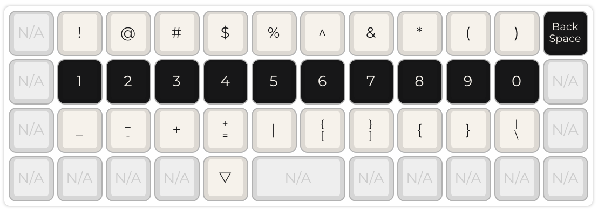
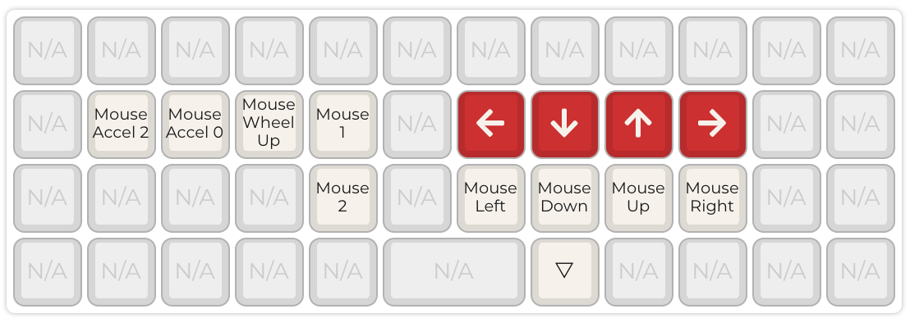

# About

Fig gives you a simple way to track, backup, and share system configurations.
This repo currently has some of my own configs.

# Usage

If you plan to use this repo, it's probably a good idea to fork it. That way you can
easily make your own changes on top of what's here.

It's important to understand that the `home` directory in this repo is intended to
mirror the directory structure of `$HOME`. It will be referred to as `fighome`.
Here's an example of how `fighome` should mirror `$HOME`: if I want a file to exist as
`~/.config/foo/bar.conf` then I should put that file in `home/.config/foo/bar.conf`.

The default behavior of fig is to create links in `$HOME` that point to their
corrisponding file in `fighome`. You can also make an entire directory point to
its corrisponding dir in `fighome`. To do this, you have to add a file named `.figlink`
to the directory (in `fighome`).

If you want to deploy these configs, follow these steps:
1. run `./extras/install-cask-pkgs.sh`
2. run `./extras/install-brew-pkgs.sh`
3. run `./create-links`
4. run `./extras/link-lazygit-config.sh`
5. run `./extras/link-lazydocker-config.sh`

At this point you may want to consider using the rest of the "extras":
* extras/alacritty-new-instance.png shows how to create a shortcut for
spawning new alacritty instances using Automator on MacOS.
* extras/vimium_c.json has configurations for a browser plugin called
[Vimium C](https://chrome.google.com/webstore/detail/vimium-c-all-by-keyboard/hfjbmagddngcpeloejdejnfgbamkjaeg?hl=en)
which gives you vim-like binding in your browser.

You may also want to remove any parts of my setup that you don't need.
For example, if you don't develop with rust or go, you may want to
remove the lines where they're sourced in the zsh config. You can quickly
edit it with `.zsh`.

# Tips
* I highly recommend simplifying your home directory. I primarily use these:
    * repos - where I clone git repos
    * save - for anything worth saving, documents, media, etc
    * temp - for scratch files, downloads, and anything I won't need in a few months

* If after installing you see and error like: `zsh compinit: insecure directories...`,
check [this](https://stackoverflow.com/a/43544733). It explains why you're seeing that
and how to fix it.

* Because holding backspace registers as holding control, you may find that you
want to repeat the delete key instead. I recommend pressing `shift+backspace` to
achieve this.

# Keyboard Layout

Keyboards are the most important interface between me and my computer.
So anything I can do to make typing more efficient, ergonomic, and intuitive
will streamline my workflow and let me think about solving challenging
problems instead of hunting for the ^ symbol.

This setup tries to achieve this by keeping everything as close to the home
row as possible. It then adds a couple extra layers so that you can press
every key in easy places.

### Base Layer

* L_GUI is Command on MacOS

### Layer 1

* active with the Command key that's left of the spacebar

### Layer 2

* active with the Command key that's right of the spacebar

<!--
# Highlights
### nvim
        plugins
        functions
        coding maps
        space maps
        term, tabs, bufs, splits
## zsh ✔
        autocomplete
        vi mode
        aliases
### lazygit ✔
        basics
        delta
        x key
### lf ✔
        marks
        H key
        hiddenFiles PR
### amethyst ✔
        bindings
        use workspaces
### karabiner ✔
        layers
### vimiumc ✔
        ? key
        disabling keys
### local/bin ✔
        swaprm
        clipedit
        historybackup
### other ✔
        docs good
### projects
        keys
        sink
        change
-->
